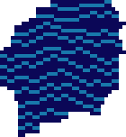
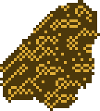
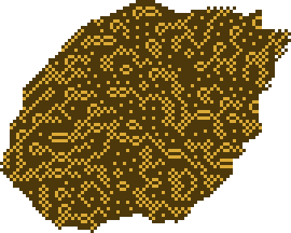
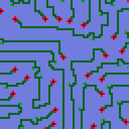
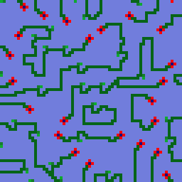
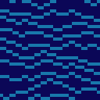
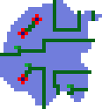

# GreedyTile

[](https://crates.io/crates/greedytile)
[](https://github.com/GeEom/greedytile/actions/workflows/ci.yml)
[](https://github.com/GeEom/greedytile/actions/workflows/rust.yml)
[](https://github.com/rust-secure-code/safety-dance/)
[](./LICENSE.txt)
[](https://codecov.io/gh/GeEom/greedytile)

Fast pattern synthesis algorithm preserving local tile constraints. Safe Rust implementation with CLI and library interfaces.

## Examples

| Source | Generated |
|--------|-----------|
|  |  |
|  |  |
|  |  |
|  |  |
|  |  |
|  |  |
|  |  |

## Installation & Usage

```bash
# Install
cargo install greedytile

# Generate pattern from source image
greedytile input.png

# Process directory of images
greedytile ./patterns/
```
## Options


| Option | Description | Default | Without Option | With Option |
|----------|-------------|---------|----------------|-------------|
| `--seed` | Seed reproducible generation | 42 |  |  |
| `--iterations` | Maximum iterations| 1000 |  |  |
| `--prefill` | Use content of `<input>_pre.png` | disabled |  |  |
| `--visualize`  | Generate placement animation | disabled | |  |
| `--width` | Maximum pixel width | unbounded |  |  |
| `--height` | Maximum pixel height | unbounded | | |
| `--rotate` | Enable 90°/180°/270° tile rotations | disabled |  |  |
| `--mirror`| Enable tile reflection | disabled |  |  |
| `--quiet` | Suppress progress output | verbose |
| `--no-skip` | Process overwriting existing output | skip existing |

## Details

GreedyTile generates patterns by placing 3×3 tiles extracted from a source image. Weights for randomly selecting placement are influenced by several factors:

1. **Entropy weighting**: Prioritizes positions where fewer tile options are valid (similar to [WFC](https://github.com/mxgmn/WaveFunctionCollapse/))
2. **Distance-based probabilities**: Pixel distance patterns in the source are replicated in the output
3. **Global balance correction**: If pixels are under-represented then selection is biased towards the source balance
4. **Deadlock recovery**: If no choices exist which respect tiles, pixels in a local area are removed before continuing

## Commentary

For efficiency, the global balance correction uses a normal distribution to approximate what should technically be a binomial distribution. The approximation becomes accurate at large counts where it matters most.

## Limitations

- **Fixed tile size**: Currently hardcoded to sample 3×3 pixel tiles from the source
- **Extensibility**: Would be improved by a plugin interface for adding new probability rules
